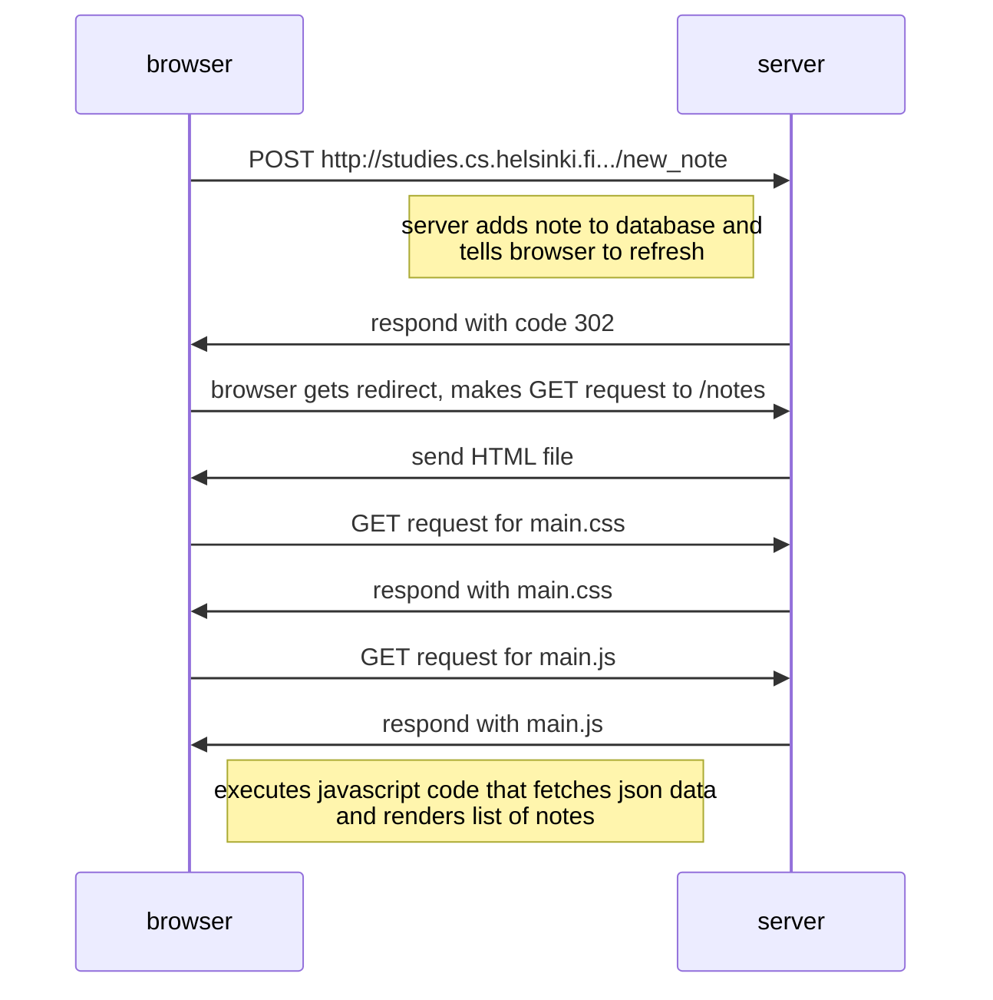

#Exercise 0.4

hey cool, check out the diagram i made with mermaid syntax, it explains the add a note flow of https://studies.cs.helsinki.fi/exampleapp/notes

```mermaid
sequenceDiagram
    participant browser
    participant server
    
    browser ->> server : POST http://studies.cs.helsinki.fi.../new_note

    Note left of server : server adds note to database and <br /> tells browser to refresh

    server ->> browser : respond with code 302

    browser ->> server : browser gets redirect, makes GET request to /notes

    server ->> browser : send HTML file 

    browser ->> server : GET request for main.css

    server ->> browser : respond with main.css

    browser ->> server : GET request for main.js

    server ->> browser : respond with main.js

    Note right of browser : executes javascript code that fetches json data <br /> and renders list of notes 

```

    
